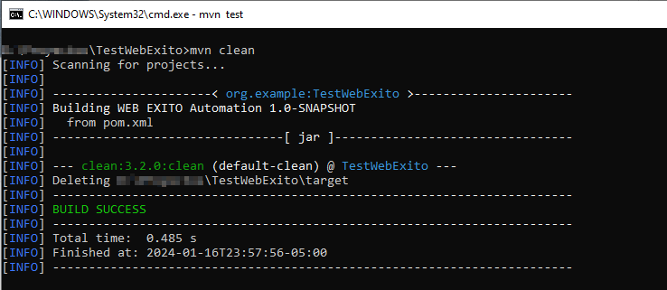
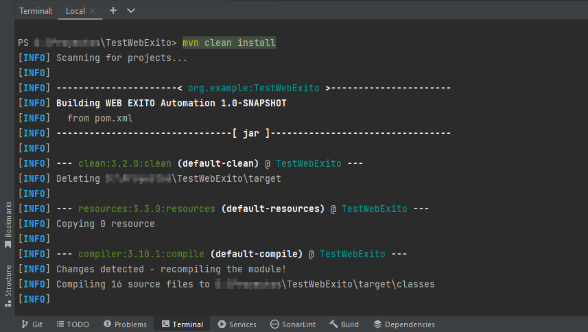
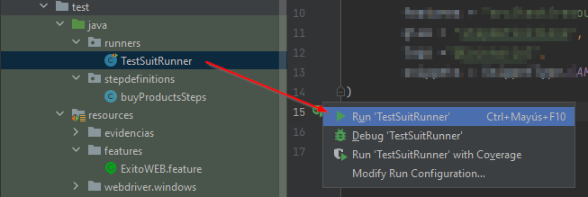
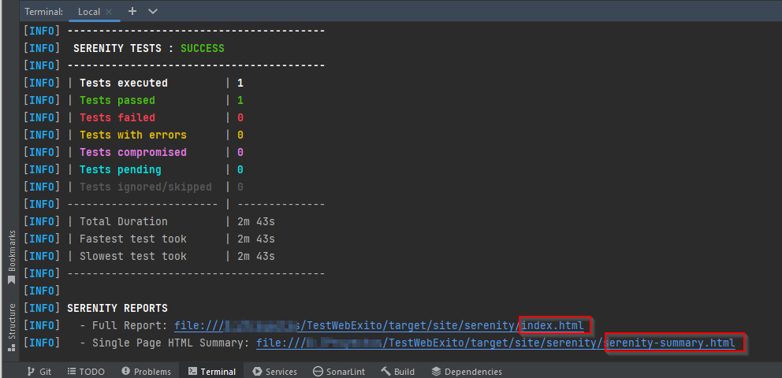
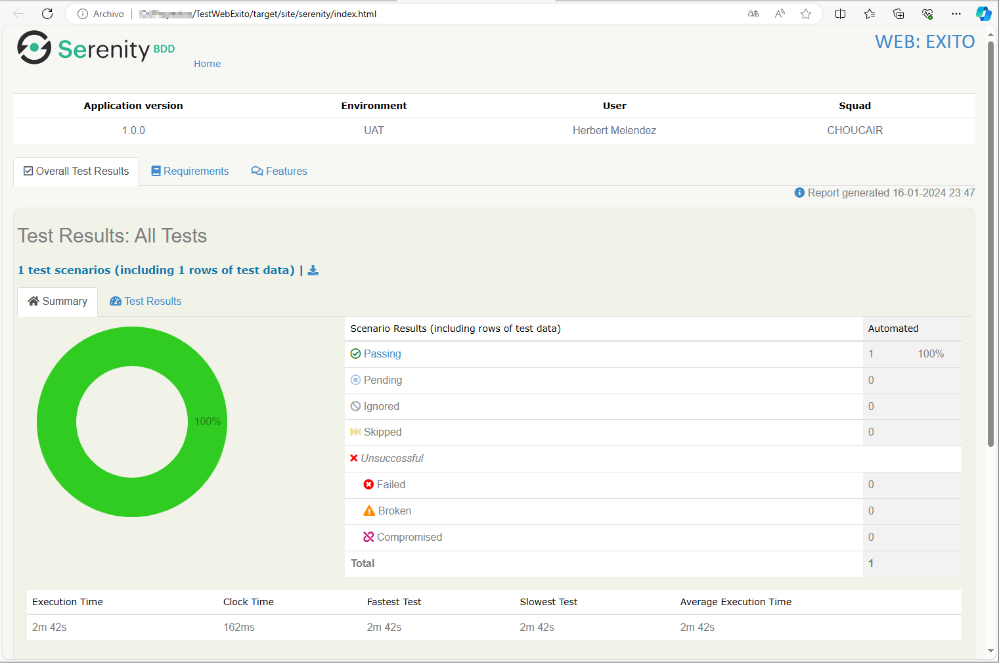
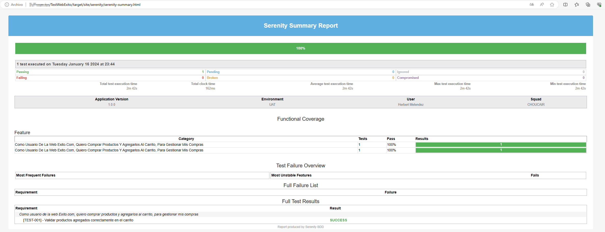

# AUTOMATIZACIÓN DE PRUEBAS WEB A EXITO.COM

Este es un proyecto de Automatización WEB que utiliza Serenity BDD Screenplay
para la creación de un framework de automatización que permita probar la web de [EXITO.COM](https://www.exito.com/)

Este proyecto ha sido desarrollado por [Herbert Melendez](https://www.linkedin.com/in/herb-me-ga/) para mejorar en el
desarrollo en pruebas avanzadas de web automation.


***

## Detalles del Tester

* Name: `Herbert Melendez`
* Country: `PERU`
* City: `Lima`
* LinkedIn: [https://www.linkedin.com/in/herb-me-ga/](https://www.linkedin.com/in/herb-me-ga/)

***

## Lenguajes & Frameworks

Este proyecto utiliza los siguientes lenguajes y frameworks:

* [Serenity BDD](https://serenity-bdd.github.io/docs/guide/user_guide_intro) como framework de pruebas
  automatizadas.
* [Cucumber](https://cucumber.io/) como software de testing BDD que permite elaborar pruebas a partir de AC.
* [Java 11](https://www.oracle.com/co/java/technologies/javase/jdk11-archive-downloads.html) como lenguaje de
  programación.
* [Screen Play](https://serenity-bdd.github.io/docs/screenplay/screenplay_fundamentals) como el patrón de
  diseño.
* [MAVEN](https://maven.apache.org/what-is-maven.html) como herramienta de compilación.

***

## Pre-requisitos:

1. Descargar la última versión estable de Java
   JDK [aquí](https://www.oracle.com/co/java/technologies/javase/jdk11-archive-downloads.html)
2. Instalar git desde [aquí](https://git-scm.com)
3. Instalar MAVEN desde [aquí](https://maven.apache.org/download.cgi)


👀 Adicional en su **IDE** de preferencia deberá tener instalados los siguientes plugins:

1. [x] *JUnit*
2. [x] *Cucumber for Java*
3. [x] *Gherkin*
4. [x] *Lombok*

***

### 🚀 Pruebas de Integración continua

**📄️ Generando los reportes de prueba**:  
Con la ejecución del pipepile se generará un artefacto `serenity-reports` donde se alojarán los reportes con los
resultados de la ejecución realizada, en la ruta `target/site/serenity`.

### 🧪 Casos de prueba contemplados

Test diseñados para validar los escenarios **Happy Paths** 😃

***
> **✨ FEATURE**: Como usuario de la web Exito.com, quiero comprar productos y agregarlos al carrito, para gestionar mis compras

>
> - [x] [TEST-001] - Validar productos agregados correctamente en el carrito
> 
***

## 🏗️ Estructura del proyecto

El proyecto tiene scripts de compilación para MAVEN las dependencias se encuentran en el archivo pom.xml y sigue la estructura la siguiente estructura basada en el patrón
de diseño de Screenplay:

```Gherkin
src
+ main                                  | Source main
+ test                                  |
+ java                                  | Test runners and supporting code
+ features                              | Features set
+ {feature_name}                        | Feature name
+ pages                                 | Pages use with webdriver test
+ steps                                 | Utility class for definition steps
+ {feature_name}Definition.java         | Definition class
+ utils                                 | General utility class
+ Runners                               | Main class
+ resources                             |
+ features                              | Feature files
     
    + {feature_name}             | Feature file  specific
{feature_name}.feature
                |
+ serenity.conf                         | Config file for Serenity
serenity.properties                     | General properties Serenity
```

***

## ▶️ Ejecución del proyecto:

1. Descarga el proyecto desde GitHub

    * **Opción 1** (HTTPS): `https://github.com/HerbertMG/Test-Web-Exito.git`
    * **Opción 2:** Descárgalo como archivo Zip y extráelo

***

2. **CD** en la carpeta `TestWebExito`.

3. Configurar MAVEN
    * Ejecute el siguiente comando en el terminal:`mvn clean`.
<p align="center">
  
</p>

***

4. Ejecutar las pruebas en el proyecto
* **Opción 1:** ejecutar `mvn clean install` en el terminal del IDE:

<p align="center">
  
</p>

* **Opción 2:** Ir a las clases de la carpeta **runners** `src/test/java/runners/TestSuitRunner.java` y ejecutar el Runner manualmente.

<p align="center">
  
</p>

***

## 📄 Generación de informes

El informe al detalle con los pasos y resultados de las pruebas que se registrará en la ruta:
`TestWebExito/target/site/serenity/index.html`, despues de ejecutar el comando `mvn clean install` de la opción 1.

<p align="center">
  
</p>

<p align="center">
  
</p>

Adicional se genera un reporte single page si se desea una revisión de alto nivel sobre los resultados de los test, el
cual se registrará en la ruta:`TestWebExito/target/site/serenity/serenity-summary.html`.

<p align="center">
  
</p>

Esta continuacion de comandos permitirá generar los reportes en pasos independientes:

```bash
mvn clean
mvn test
mvn serenity:aggregate
```

***